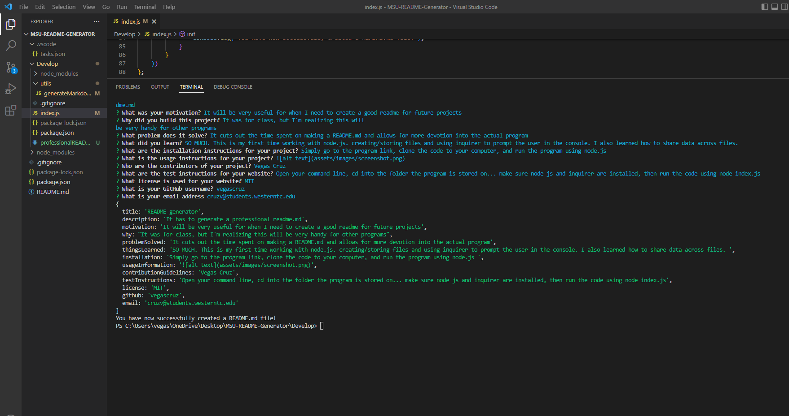

  # README generator

  ## License: MIT [
  ### https://choosealicense.com/licenses/mit/

  ## Description
  It has to generate a professional readme.md
  
  ## Table of Contents
  ###  * [Installation](#installation)
  ###  * [Usage](#usageInformation)
  ###  * [Motivation](#motivation)
  ###  * [Why](#why)
  ###  * [Problem Solved](#problemSolved)
  ###  * [Things Learned](#thingsLearned)
  ###  * [Contributors](#contributionGuidelines)
  ###  * [Tests](#testInstructions)
  ###  * [License](#license)
  ###  * [Questions](#questions)
  
  ## Installation
  Simply go to the program link, clone the code to your computer, and run the program using node.js 

  ## Usage
  

  ## Motivation
  It will be very useful for when I need to create a good readme for future projects

  ## Why?
  It was for class, but I'm realizing this will be very handy for other programs

  ## Problem Solved?
  It cuts out the time spent on making a README.md and allows for more devotion into the actual program

  ## Things Learned
  SO MUCH. This is my first time working with node.js. creating/storing files and using inquirer to prompt the user in the console. I also learned how to share data across files. 

  ## Contributors
  Vegas Cruz

  ## Tests
  Open your command line, cd into the folder the program is stored on... make sure node js and inquirer are installed, then run the code using node index.js

  ## License
  MIT
  
  ## Questions? Feel free to email or message me.
  ### GitHub: https://github.com/vegascruz
  ### Email: cruzv@students.westerntc.edu
